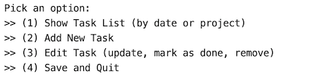

# ToDo List
--------------------------------------
--------------------------------------

## Project Brief


### Specification

The task is to build a todo list application. The application will allow a user to create new tasks, assign them a title and due date, and choose a project for that task to belong to. We will need to use a text based user interface via the command-line . Once they are using the application, the user should be able to also edit, mark as done or remove tasks. They can also quit and save the current task list to file, and then restart the application with the former state restored. The interface should look similar to the mockup below:
```python
 Welcome to ToDoLy
 You have X tasks todo and Y tasks are done!
 Pick an option:
 (1) Show Task List (by date or project)
 (2) Add New Task
 (3) Edit Task (update, mark as done, remove)
 (4) Save and Quit
```
### Requirements
The solution must achieve the following requirements:
* A task with :
1) Title
2) due date
3) status 
4) project
5) Display a collection of tasks that can be sorted:
  5-1) by date 
  5-2) by project
6) The ability to add
7) The ability to edit
8) The ability to mark as done
9) The ability to remove tasks
10) Support a text-based user interface
11) Load task list to file
12) save task list to file
 
### This is the Main menu:

 
 

User will choose one of the options from the menu, then will recieve guides for next steps.


